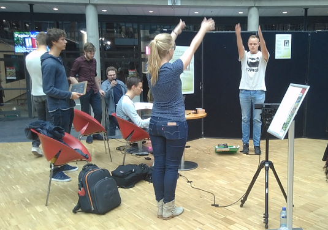

# portfolioKB74
Welkom op mijn portfolio, gemaakt voor de KB74 minor. Tijdens deze minor ben ik groepslid van de groep Pepper. Deze groep doet onderzoek naar het gebruik van 3D-camera's in de zorg. Concreter: kan een fysiotherapeut gebruik maken van een 3D-camera bij het bepalen van painful arcs* bij patiënten?

* Een painful arc is het gebied in de beweging waarbinnen de patiënt pijn of ongemak ervaart. 

## Week 1
In de eerste week van de minor ben ik met mijn groep vooral bezig geweest met verkennen van de opdracht. De eerste literatuur is gezocht en de eerste vragen zijn gesteld. Ook hebben we een naam voor de groep bedacht: groep Pepper. 

Een van de eerste opdrachten als groep was de Scrum Lego Workshop van Tony Andrioli. Een leuke manier om kennis te maken met groepsgenoten en met Scrum. Al snel hadden we binnen de groep een taakverdeling en de communicatie ging elke sprint beter. 

**Datacamp**: Intro to Python for Data Science ([zie screenshot](images/DataCamp1.png))

## Week 2
In week 2 zijn we gericht gaan zoeken naar literatuur, ik heb mij vooral beziggehouden met zoeken naar informatie over schoudergewrichten, -protheses en oefeningen. Dit heb ik samen met Maricruz gedaan. Samen hebben we toen een document opgesteld met belangrijke informatie, medische termen en een algemeen beeld van de schouder.

We hebben deze week ook al een aantal eerste tests gedaan met de RealSense camera. Aan de hand van de data die we hiermee verkregen hebben we de eerste dieptebeelden omgezet in afbeeldingen waar we iets aan kunnen zien. In de figuur hieronder is daar een voorbeeld van te zien.

#### Presentatie
Aan het eind van week 2 heb ik in mijn eentje de tweede presentatie gedaan. Hiervoor heb ik een PowerPoint [presentatie](presentations/Presentatie_1_extern.pdf) gemaakt, die tijdens volgende presentaties ook als template wordt gebruikt.

**Datacamp**: Intermediate Python for Data Science, Introduction to visualization with Python, Importing data in Python path 1 ([zie screenshot](images/DataCamp1.png) en [screenshot](images/DataCamp2.png))

## Week 3
Op dinsdag 12 september zijn we met een aantal groepsleden voor een eerste gesprek met de opdrachtgever naar het LUMC geweest. Hier hebben we gesproken met fysiotherapeut en leidinggevende van de afdeling, dr. Eric Vermeulen. Tijdens het gesprek heb ik genotuleerd, de notulen hiervan zijn [hier](documents/Notulen_gesprek_DrEricVermeulen_LUMC.docx) te vinden. Tijdens dit gesprek is de opdracht veel duidelijker geworden: we gaan niet kijken naar schouderprotheses, maar naar de beweeglijkheid van het gewricht bij allerlei patiënten. Patiënten met schouderklachten hebben vaak bepaalde bewegingen die pijn doen, dit worden 'painful arcs' genoemd. 
Extra contact benaderd
Besluit verder met Kinect

**Datacamp**: Python Data Science Toolbox (Part 1), Pandas foundation ([zie screenshot](images/DataCamp1.png) en [screenshot](images/DataCamp2.png))

**Coursera**: Machine Learning - Linear Regression with One Variable ([zie screenshot](images/Coursera1.png))

## Week 4
Literatuur zoeken/lezen/samenvatten /TODO [samenvattingen toevoegen].

#### Wiskunde sessie 1 
Variable, function, first order functions, gradient, intercept. Hiervoor heb ik gebruik gemaakt van een [presentatie](presentations/math_behind_ml_1.pdf) van BlackBoard.
#### Wiskunde sessie 4 
Gradient descent, derivative, learning rate, update rules, batch gradient descent. Hiervoor heb ik gebruik gemaakt van een [presentatie](presentations/math_behind_ml_4.pdf) van BlackBoard.

**Datacamp**: Python Data Science Toolbox (Part 2), Introduction to data visualization with Python ([zie screenshot](images/DataCamp2.png))

**Coursera**: Machine Learning - Linear Regression with Multiple Variables ([zie screenshot](images/Coursera2.png))

## Week 5
Deze week heb ik onder andere een poster gemaakt om studenten te informeren over ons project. Op deze poster staat wat onze opdracht is, waarom we daarvoor data nodig hebben en hoe we deze data willen verzamelen.

#### Wiskunde sessie 10 
Ook heb ik deze week weer een wiskunde sessie gegeven. Deze sessie ging over polynomial regression en de normal equation, hiervoor heb ik gebruik gemaakt van een [presentatie](presentations/math_behind_ml_10.pdf) van BlackBoard.

**Datacamp**: Cleaning Data ([zie screenshot](images/DataCamp1.png))

**Coursera**: Machine Learning - Logistic Regression & Regularization ([zie screenshot](images/Coursera3.png))

## Week 6
Poster voor opnames afgerond
Data opnemen in Atrium: voordoen/begeleiden oefeningen 
Eerste grafieken gemaakt met test-data [afbeelding toevoegen]

**Datacamp**: Statistical Thinking in Python (part 1), Supervised Learning with Skicit-learn ([zie screenshot](images/DataCamp1.png))

**Coursera**: Machine Learning - Advice for Applying Machine Learning ([zie screenshot](images/Coursera6.png))

## Week 7
In week 7 ben ik voornamelijk bezig geweest met het uitwerken van algoritmes. Allereerst een algoritme om lichamen te roteren wanneer deze niet recht voor onze Kinect camera stonden. Vervolgens heb ik een begin gemaakt aan een algoritme om de hoek tussen de arm en de ruggengraat te bereken. Aan de hand van deze hoek kan de fysiotherapeut iets zeggen over de klachten/oorzaken van pijn bij patiënten.  
[code toevoegen?]

## Week 8
In week 8 ben ik bezig geweest met het maken van grafieken met behulp van de eerder uitgewerkte algoritmes. Om de grafieken te maken heb ik nog een functie geschreven om de tijd te normaliseren. Aan het einde van week 8 konden we daardoor voor bijna alle proefpersonen een grafiek maken van oefening 1 (de oefening waarbij de armen naast het lichaam omhoog bewogen diende te worden). In de figuur hieronder staat een voorbeeld van een grafiek van één persoon. 

Door het normaliseren van de tijd, kunnen personen onderling vergeleken worden. In de figuur hieronder zijn vijf personen samengevoegd in één grafiek.

Van een aantal personen hebben we nog geen grafiek, omdat er sprake is van meer dan één skelet. Dit skelet moet er eerst nog uitgefilterd worden door het cleanen van de data.

Ook ben ik bezig geweest met de **Spark tutorials en de assignments**.

## Week 9

## Week 10

## Week 11

## Week 12

## Week 13

## Week 14

## Week 15

## Week 16

## Week 17

## Week 18

## Week 19

## Week 20
