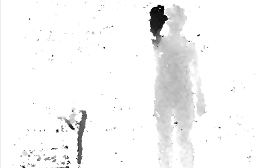
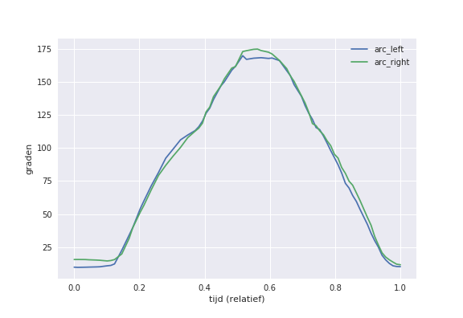
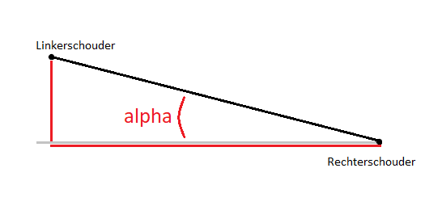

# portfolioKB74
Welkom op mijn portfolio, gemaakt voor de KB74 minor. Tijdens deze minor ben ik groepslid van de groep Pepper. Deze groep doet onderzoek naar het gebruik van 3D-camera's in de zorg. Concreter: kan een fysiotherapeut gebruik maken van een 3D-camera bij het bepalen van painful arcs bij patiënten?

# Datacamp
Op Datacamp heb ik de volgende courses gevolgd:
- Intro to Python for Data Science 
- Intermediate Python for Data Science
- Introduction to visualization with Python 
- Importing data in Python path 1 
- Python Data Science Toolbox (Part 1)
- Pandas foundation
- Python Data Science Toolbox (Part 2)
- Introduction to data visualization with Python
- Cleaning Data
- Statistical Thinking in Python (part 1)
- Supervised Learning with Skicit-learn

Screenshots: [zie](images/DataCamp1.png) en [zie](images/DataCamp2.png)

# Coursera
Op Coursera heb ik de volgende courses gevolgd:
- Machine Learning - Linear Regression with One Variable ([zie screenshot](images/Coursera1.png))
- Machine Learning - Linear Regression with Multiple Variables ([zie screenshot](images/Coursera2.png))
- Machine Learning - Logistic Regression & Regularization ([zie screenshot](images/Coursera3.png))
- Machine Learning - Advice for Applying Machine Learning ([zie screenshot](images/Coursera6.png))

# Mijn resultaten

## Dieptebeelden
#### Eerste dieptebeelden
Eerste dieptebeelden gemaakt met de Intel Realsense camera omgezet in grijswaarden. Gezocht naar een range van afstanden waarbinnen de persoon staat, en deze omgezet in grijswaarden.

## Literatuur 
De [samenvattingen](documents/Samenvattingen.md) die ik gemaakt heb.

## Opnames Atrium
#### Poster opnames Atrium
Poster ter informatie voor studenten.

#### Opnames maken Atrium

## Grafieken
#### Eerste grafieken Excel

### Eerste grafieken Python

# Wiskunde in code
## Normalisatie
Voor elke exercise neem ik de volgende stappen om de tijd te normaliseren:
1. Eerste frame op 0 seconden zetten en vervolgens voor elk volgend frame het verschil met het vorige frame berekend en deze cumulatief opgeteld.
2. Voor elk frame deel ik het aantal seconden door het aantal seconden van het laatste frame.
In code ziet dit er als volgt uit: [toon code.](notebooks/Normalization.md)

## Rotatie lichaam
Om de verschillende hoeken tussen de arm en het lichaam goed te berekenen, is het van belang dat het lichaam 'recht voor de camera' staat. Omdat niet iedereen tijdens het maken van de opnames recht voor de camera stond, heb ik code geschreven die de lichamen recht zet. Dit doe ik aan de hand van de volgende stappen:
1. Allereerst zet ik de x- en z-coördinaten van de rechterschouder in de oorsprong, waarna ik alle andere lichaamspunten (joints) met dezelfde translatie verplaats.
2. Vervolgens bepaal ik de hoek alpha met behulp van de formule tan(alpha) = overstaande zijde/aanliggende zijde. Dit is weergegeven in de volgende afbeelding: 
3. Daarna roteer ik alle punten met de gegeven hoek, met behulp van de rotatiematrix.

## Hoeken berekenen 
Wanneer het lichaam recht staat, kan de gewenste hoek berekend worden. 

# Notebooks
- [algoritmes, eerste versie](notebooks/Combined_to_plot.ipynb)
- [functies voor "treintje"](notebooks/Seperated_functions.md)

# Opdrachten

#### Exploratory Data Analysis
| Nr. | Naam |
| --- | --- |
| 1 | [Check Data Edges](notebooks/1CheckDataEdges.md) |
| 2 | [Variable Identification](notebooks/2VariableIdentification-Codebook.md) |
| 3 | [Univariate Analysis](notebooks/3UnivariateAnalysis.md) |
| 4 | [Bi-variate Analysis](notebooks/4Bi-variateAnalysis.md) |
| 5, 6 | [Missing data and outliers](notebooks/5+6MissingDataOutliers.md) |
| 7 | [Transformation](notebooks/7Transformation.md) |
| 8 | [Variable creation](notebooks/8Variablecreation.md) |
| 9 | [Evaluation](notebooks/9Evaluation.md) |

#### Spark assignments
| Nr. | Naam |
| --- | --- |
| 1 | [Assignment 1](notebooks/assignment1.md) |
| 2 | [Assignment 2](notebooks/assignment2.md) |

# Presentaties
| Nr. | Intern/Extern | Presentatie |
| --- | --- | --- |
| 1 | Extern | [presentatie](presentations/Presentatie_1_extern.pdf) |

# Extra's

### Wiskunde sessie's

| Nr. | Onderwerpen | Presentatie
| --- | --- | --- |
| 1 | Variable, function, first order functions, gradient, intercept | [presentatie](presentations/math_behind_ml_1.pdf) |
| 4 | Gradient descent, derivative, learning rate, update rules, batch gradient descent | [presentatie](presentations/math_behind_ml_4.pdf) |
| 10 | Polynomial regression and the normal equation | [presentatie](presentations/math_behind_ml_10.pdf) |
