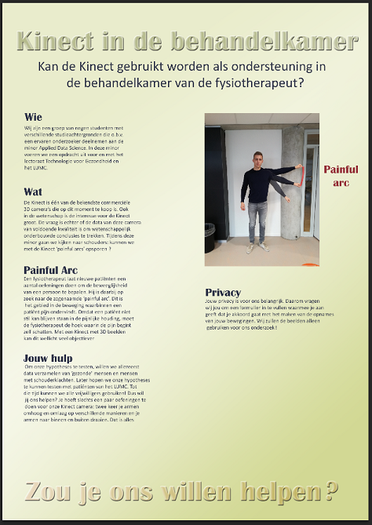
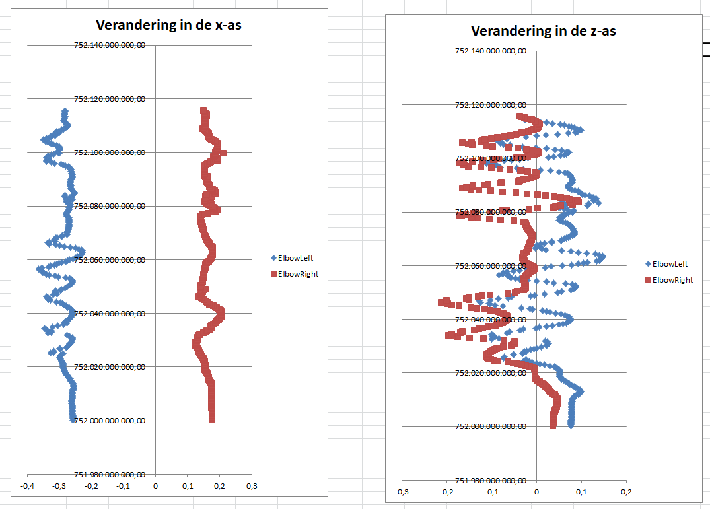
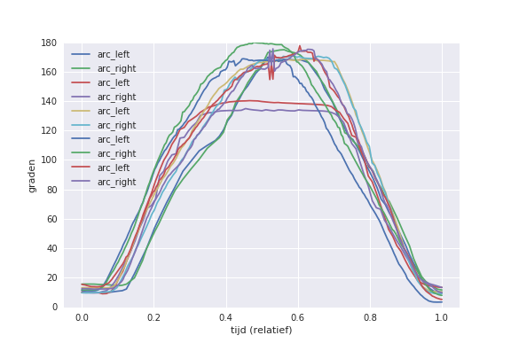

# portfolioKB74
Welkom op mijn portfolio, gemaakt voor de KB74 minor. Tijdens deze minor ben ik groepslid van de groep Pepper. Deze groep doet onderzoek naar het gebruik van 3D-camera's in de zorg. Concreter: kan een fysiotherapeut gebruik maken van een 3D-camera bij het bepalen van painful arcs bij patiënten?

# Datacamp
Op Datacamp heb ik de volgende courses gevolgd:
- Intro to Python for Data Science 
- Intermediate Python for Data Science
- Introduction to visualization with Python 
- Importing data in Python path 1 
- Python Data Science Toolbox (Part 1)
- Pandas foundation
- Python Data Science Toolbox (Part 2)
- Introduction to data visualization with Python
- Cleaning Data
- Statistical Thinking in Python (part 1)
- Supervised Learning with Skicit-learn

([zie](images/DataCamp1.png) en [zie](images/DataCamp2.png))

# Coursera
Op Coursera heb ik de volgende courses gevolgd:
- Machine Learning - Linear Regression with One Variable ([zie screenshot](images/Coursera1.png))
- Machine Learning - Linear Regression with Multiple Variables ([zie screenshot](images/Coursera2.png))
- Machine Learning - Logistic Regression & Regularization ([zie screenshot](images/Coursera3.png))
- Machine Learning - Advice for Applying Machine Learning ([zie screenshot](images/Coursera6.png))

# Taken/Resultaten
De volgende taken/resultaten heb ik uitgevoerd:
#### Eerste dieptebeelden

#### Samenvattingen artikelen 
samenvattingen artikelen
#### Poster opnames Atrium

#### Opnames maken Atrium

#### Eerste grafieken Excel

#### Eerste grafieken Python

##### Normalisatie
Voor elke exercise neem ik de volgende stappen om de tijd te normaliseren:
1. Eerste frame op 0 seconden zetten en vervolgens voor elk volgend frame het verschil met het vorige frame berekend en deze cumulatief opgeteld.
2. Voor elk frame deel ik het aantal seconden door het aantal seconden van het laatste frame.
In code ziet dit er als volgt uit: [toon code.](notebooks/Normalization.md)

# Notebooks
- [algoritmes, eerste versie](notebooks/Combined_to_plot.ipynb)
- [functies voor "treintje"](notebooks/Seperated_functions.md)

# Opdrachten

# Presentaties
PowerPoint [presentatie](presentations/Presentatie_1_extern.pdf)

# Extra's

#### Wiskunde sessie 1 
Variable, function, first order functions, gradient, intercept. Hiervoor heb ik gebruik gemaakt van een [presentatie](presentations/math_behind_ml_1.pdf) van BlackBoard.
#### Wiskunde sessie 4 
Gradient descent, derivative, learning rate, update rules, batch gradient descent. Hiervoor heb ik gebruik gemaakt van een [presentatie](presentations/math_behind_ml_4.pdf) van BlackBoard.
#### Wiskunde sessie 10 
Ook heb ik deze week weer een wiskunde sessie gegeven. Deze sessie ging over polynomial regression en de normal equation, hiervoor heb ik gebruik gemaakt van een [presentatie](presentations/math_behind_ml_10.pdf) van BlackBoard.
